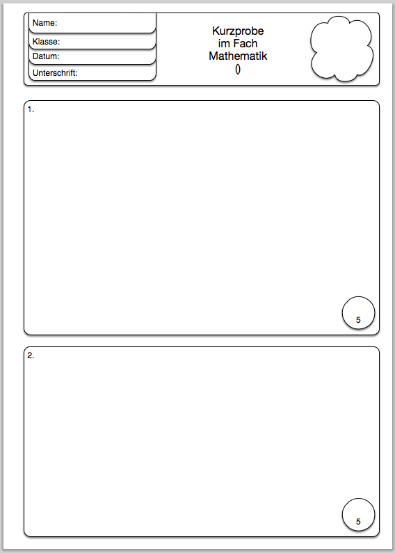
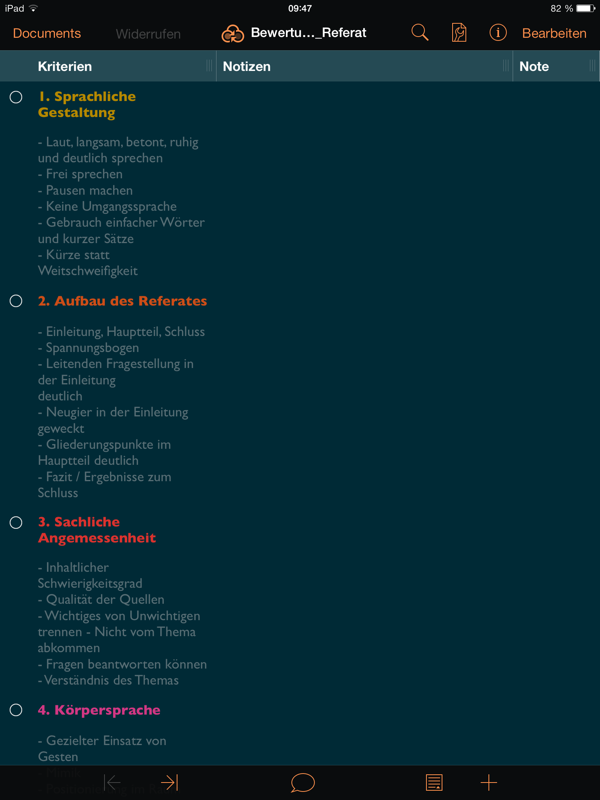
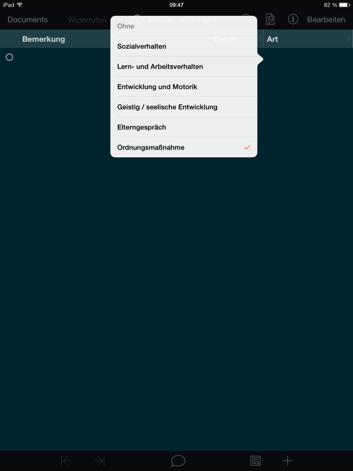

### Templates für Lehrkräfte:

#### OmniGraffle

* Vorlage für Proben, Stegreifaufgaben, Schulaufgaben, Tests,... you name it!
  (probe.gtemplate)

#### OmniOutliner

* Vorlage, zum Bewerten von Referaten (bewertungsraster_Referat.oo3template)

* Vorlage, um Schülerbeobachtungen zu notieren (schuelerbeobachtungen.oo3template)

